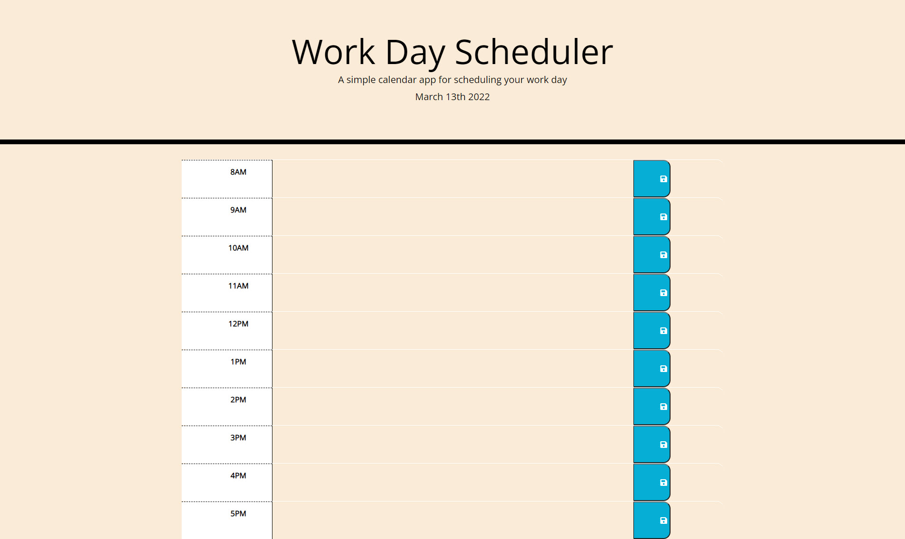

During this week of UTSA's Coding Bootcamp, we were given a directive of creating a Work Day Scheduler. We were provided Acceptance Criteria of having time blocks for standard business hours, having a text areas to submit tasks and beign able to save them. All tasks also needed to be saved and persist in local storage. 

We were provided starter code from @Xandromus's coding bootcamp repo: https://github.com/coding-boot-camp/super-disco. All other coding was done by me in VS Code and saved in GitHub. 

You can find me repo code here: https://github.com/amhernandez1163/work-day-scheduler-5 

The final product can be found here: https://amhernandez1163.github.io/work-day-scheduler-5/

